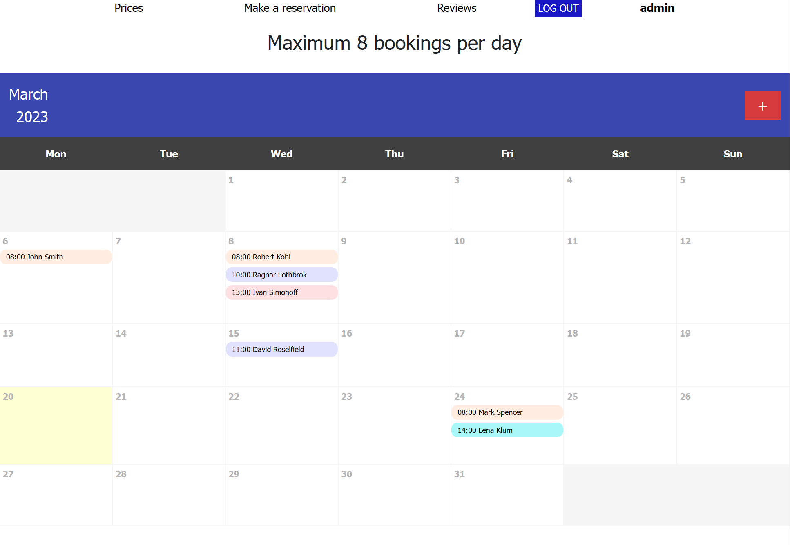
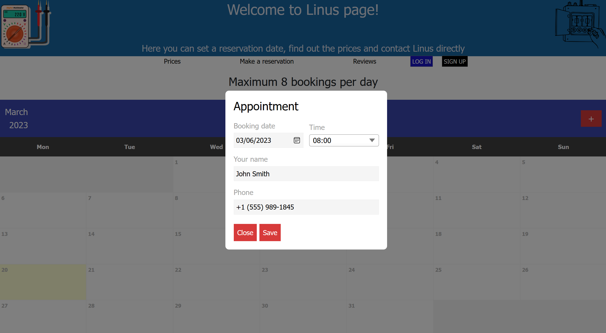

# Website that allows you to make a booking for calling an electrician at home.

## :book: How to use

The database login details is located in classes/dbh.classes.php.
To set up the MySQL tables you should type and load setup.php into your browser before calling up any other files; otherwise, you’ll get numerous MySQL errors.
The default Administrator user password and login are placed in setup.php.

## :large_blue_diamond: Features

* The ability to see free and busy days and hours for calling an electrician.
* No registration is required to select the date and time of the electrician's call to the house and to make an appointment.
* For registered users, it becomes possible to manage their records.
* The administrator can see and manage all records.
* It is also possible to leave feedback.

## :large_blue_circle: Preview

## :large_orange_diamond: Reasonings

This project was created only for learning purposes and inspired by [codedoor](https://codedoor.com "codedoor"). In part, it was based on existing developments that were modified and redesigned. 
Pictures were taken from free repository [pixabay.com](https://pixabay.com "pixabay").
Reviews system  based on David Adam's tutorial on [codeshack.io](https://codeshack.io/review-system-php-mysql-ajax/ "codeshack.io").
Booking system based on Simple Events Calendar with PHP MySQL tutorial from [Code Boxx](https://code-boxx.com/simple-php-calendar-events/ "Code Boxx"). 

Original task was:
"Linus is an electrician. While he works on projects outside of his office he gets about 4 to 5 calls per day on his mobile phone by potentially new clients. This can be very distracting. He wishes that he had a website where his clients can see his availability and book him online."

## :star2: Support
Like this project? Just give it a star. That will indirectly help grow my blog a little bit. 